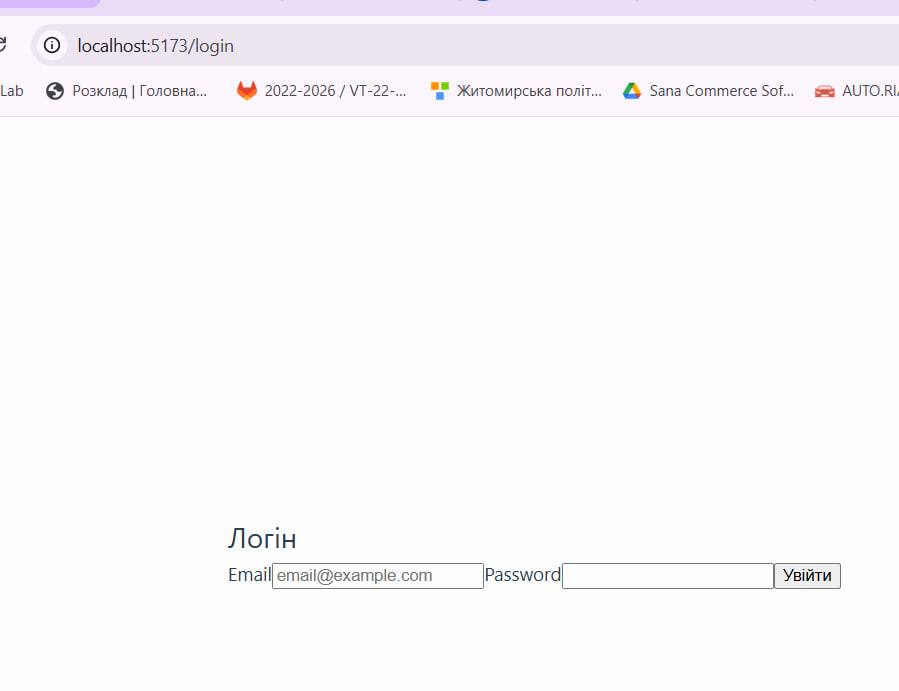
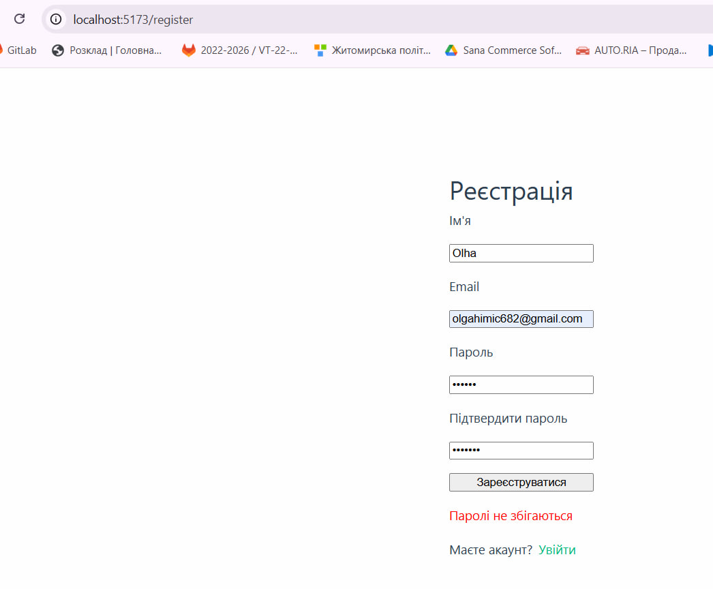
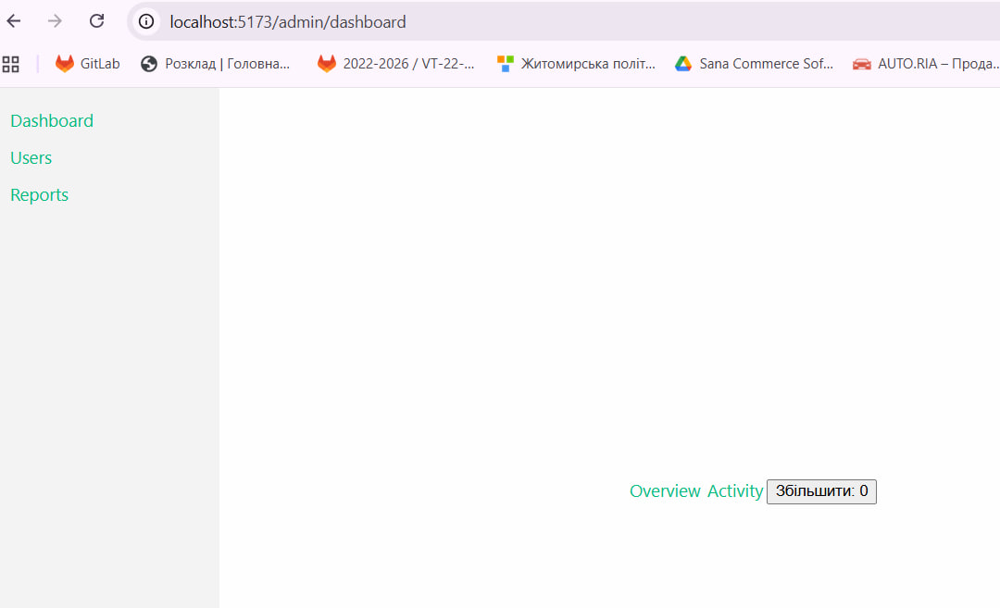
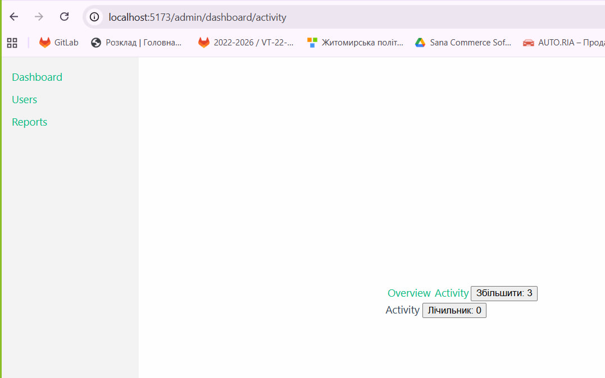
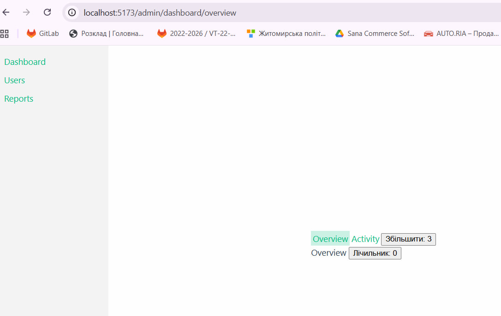
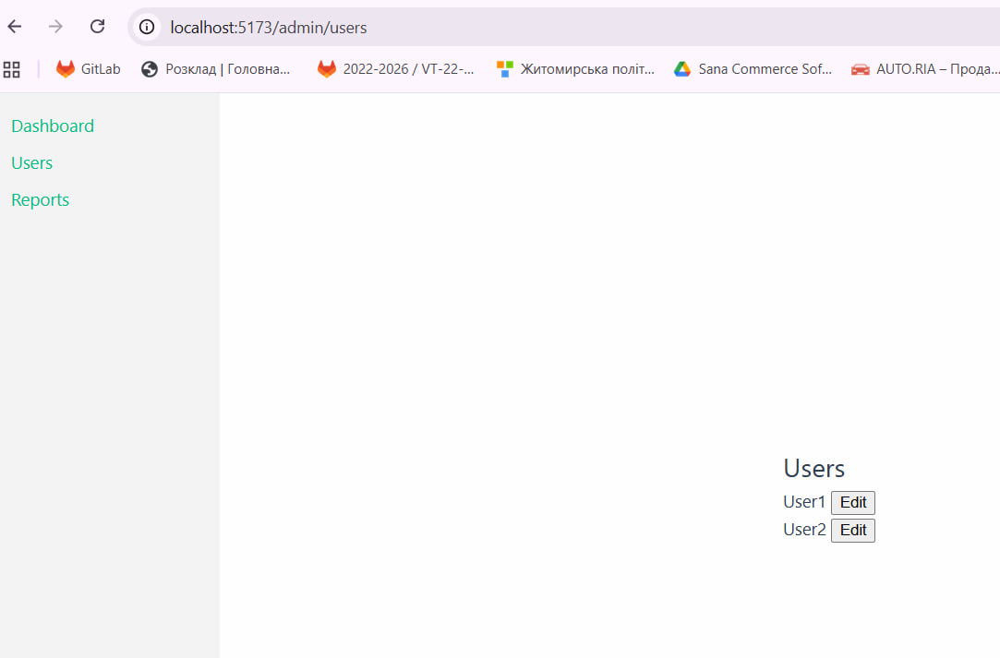
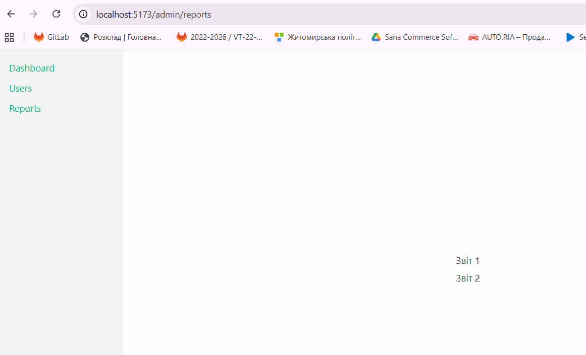
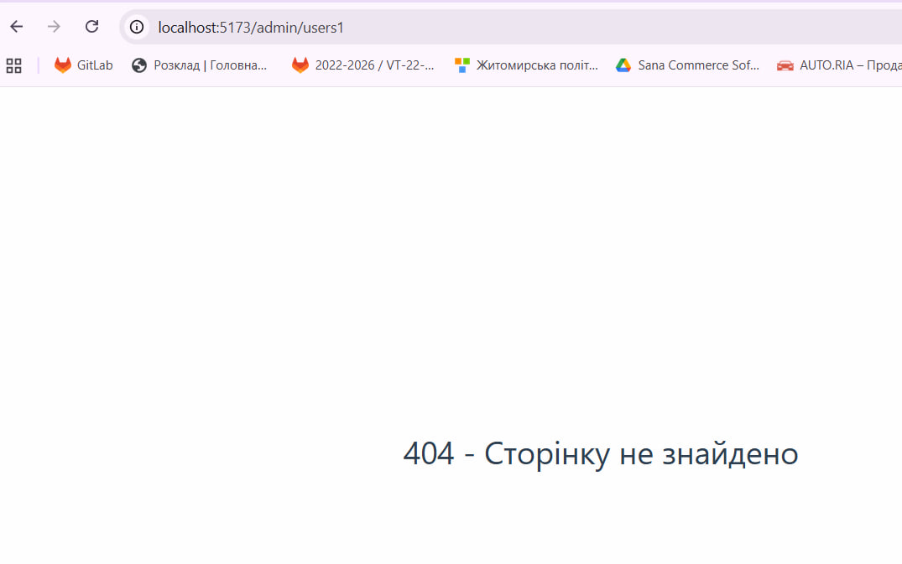

# Лабораторна робота №2: Взаємодія між компонентами та роутинг у Vue.js

## Опис проєкту
Цей проєкт є міні-адмінкою з імітацією автентифікації, роутингом та взаємодією компонентів. Використано Vue 3 (Composition API), Vue Router 4 та Vite. Бекенд імітується локально без реального API. Проєкт демонструє ключові механізми Vue: props/emits, v-model/defineModel, provide/inject, слоти, KeepAlive, lazy-loading маршрутів та navigation guards.

## Кроки запуску
1. Клонувати репозиторій: `git clone https://github.com/KhimichOlha/VueJSLabs2025.git`.
2. Перейти в папку lab2: `cd lab2`.
3. Встановити залежності: `npm install`.
4. Запустити проєкт: `npm run dev`.
5. Відкрити в браузері: http://localhost:5173/.
6. Для перевірки: зареєструйтеся або увійдіть (використовуйте тестові дані: email `test@example.com`, password `password`).

## Скріншоти
- **Форма логіну**:  
    
  (Форма з використанням слотів у AuthWrapper та окремих інпутів з v-model.)

- **Форма реєстрації**:  
    
  (Валідація паролів та перенаправлення після успіху.)

- **Адмін-панель (Dashboard з підвкладками)**:  
    
  (Навігація, збереження стану через KeepAlive.)

 - **Збереження стану через KeepAlive**:
   

 - **Збереження стану через KeepAlive**:
   

- **Сторінка Users**:  
    
  (Список з props/emits для редагування.)

- **Сторінка Reports**:  
    
  (Таблиця зі scoped слотом для кастомного рендеру.)

- **NotFound (404)**:  
    
  (Catch-all маршрут.)

## Короткий опис застосування ключових фіч

### props/emits
- Застосовано в `UserItem.vue`: props для передачі даних користувача з батьківського `Users.vue`, emits для події редагування (`@edit`).
- Також у `InputField.vue`: props для type, label, placeholder.

### v-model/defineModel
- Застосовано в окремому компоненті `InputField.vue`: використовується `defineModel` для двостороннього біндингу в формах логіну/реєстрації (`Login.vue`, `Register.vue`).

### provide/inject
- Застосовано в `Admin.vue`: provide 'userData' для даних авторизованого користувача (з `useAuth`).
- Inject у `Dashboard.vue`: зчитування даних і умовне відображення UI (наприклад, "Привіт, {{ userData.value.name }}" з v-if).

### Слоти
- Обгортка для форм: `AuthWrapper.vue` з слотом для вмісту форм у `Login.vue` та `Register.vue`.
- Меню: `Sidebar.vue` з слотом для навігаційних посилань.
- Scoped слот у `Reports.vue`: #row="{ item }" для кастомного рендеру рядків таблиці (демо: toUpperCase() у батьківському).

### KeepAlive
- Застосовано в `Dashboard.vue`: підвкладки Overview/Activity загорнуті в `<KeepAlive include="Overview,Activity" max="2">` з `<RouterView />`.

### Роутинг
- **Default RouterView**: Використано в `Admin.vue` для рендеру дочірніх маршрутів (/admin/*) та в `Dashboard.vue` для підвкладок (overview/activity).
- **Named toolbar**: Sidebar як named view не реалізовано явно, але меню в `Sidebar.vue` стилізується як toolbar з linkActiveClass; для повного named view можна додати `<router-view name="toolbar" />` в `Admin.vue` з відповідним роутом.
- **Lazy-loading**: Усі дочірні маршрути /admin/* завантажуються lazy через `() => import('@/views/...')`.
- **Guard’и**: beforeEach у `router/index.js` перевіряє meta.requiresAuth і редіректить на /login якщо не авторизовано.
