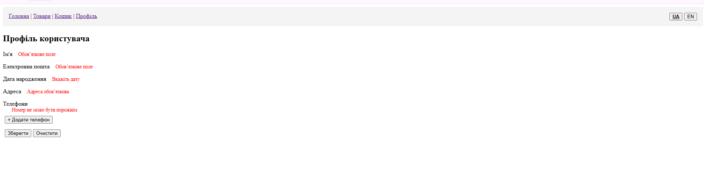

# Лабораторна робота №4: Управління станом (Pinia), локалізація (vue-i18n) та валідація форм (VeeValidate) у Vue 3 

## Опис проєкту
Цей проєкт є міні-застосунок «Profile & Cart»: 
- Стор settings (Pinia) з 
персистентним(pinia-plugin-persistedstate) locale. 
- Стор cart з товарами, підрахунком сум і діями 
(add/remove/clear). 
- Стор products. 
- Перемикач мови (ua/en) у UI. 
- Сторінка Profile з формою (VeeValidate + Yup/Zod): ім’я, email, 
dateOfBirth, адреса, масив телефонів (useFieldArray), з 
локалізованими повідомленнями про помилки. 
- Сторінка Cart з локалізованими рядками й коректною 
інтеграцією зі стором. 
- Сторінка Products. 

## Кроки запуску
1. Клонувати репозиторій: `git clone https://github.com/KhimichOlha/VueJSLabs2025.git`.
2. Перейти в папку lab2: `cd lab4`.
3. Встановити залежності: `npm install`.
4. Запустити проєкт: `npm run dev`.
5. Відкрити в браузері: http://localhost:5173/.

## Скріншоти
- **Сторінка профілю (UA)**:  
    

- **Валідація та динамічні поля (Помилки)**:  
    

- **Кошик та локалізація (EN)**:  
    

## Короткий опис застосування ключових фіч

1. Pinia (Управління станом) 

Використовується для зберігання налаштувань та даних кошика.

createPinia: Підключено в src/main.js.

defineStore: Створено три стори:

settings.js: зберігає поточну локаль.

cart.js: логіка кошика (додавання, видалення, підрахунок суми).

products.js: мок-дані товарів.

storeToRefs: Використано в CartView.vue для збереження реактивності при деструктуризації (items, totalPrice).

pinia-plugin-persistedstate: Налаштовано в stores/settings.js. Використано селективну персистентність (pick: ['locale']) та власний ключ (key: 'my-lab4-settings') .

2. vue-i18n (Локалізація) 

Реалізовано перемикання між Українською (UA) та Англійською (EN) мовами.

createI18n: Налаштовано в src/i18n.js.

messages: Переклади знаходяться в папці src/locales/ (ua.json, en.json).

Кастомний модифікатор: Створено модифікатор quoted (додає лапки «...»), застосовано у заголовку Кошика ({{ $t('cart.title.quoted') }}).

Синхронізація:

При завантаженні (main.js): i18n зчитує мову зі збереженого стану Pinia.

При зміні (stores/settings.js): зміна стейту автоматично оновлює i18n.global.locale.

3. VeeValidate + Yup (Валідація форм) 

Реалізовано на сторінці Профілю (ProfileView.vue).

useForm: Ініціалізація форми зі схемою.

validationSchema: Використано toTypedSchema з бібліотекою Yup. Валідація включає:

Обов'язкові поля, email формат, мінімальну довжину.

Regex перевірку для телефонів.

useFieldArray: Реалізовано динамічний масив полів для номерів телефонів (додавання/видалення input-ів).

setFieldError: Емуляція помилки сервера. Якщо ввести email error@test.com, скрипт повертає помилку "Цей email вже використовується".

---
Автор: Хіміч Ольга
Група: ВТ-22-1